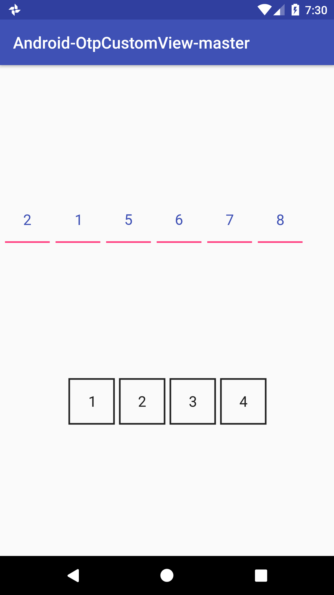

# AndroidOtpCustomViewmaster

This is custom input widget for OTP and passwords. It's beautiful and easy to you!

<p>

## Dependency

``` Groovy
repositories {
    maven {
        jcenter()
    }
}
...

dependencies {
	        compile 'com.github.Temidtech:AndroidOtpCustomViewmaster:1.0'
}
```

## Usage

OtpCustomView is written in Kotlin language, it's light-weight and simple to implement.OtpCustomView inherits from EditText, which implies you can use all the APIs from EditText.

### Step 1:

Include OtpCustomView in your layout.

#### XML

``` xml
<com.swiftsynq.otpcustomview.CustomOtpView
    android:id="@+id/otpView"
    android:layout_width="wrap_content"
    android:layout_height="wrap_content"
    android:cursorVisible="true"
    app:cursorColor="@color/colorAccent"
    app:cursorWidth="2dp"
    app:itemCount="6"
    app:itemHeight="52dp"
    app:itemRadius="2dp"
    app:itemSpacing="0dp"
    app:itemWidth="36dp"
    android:hint="Hello."
    android:inputType="text"
    android:padding="@dimen/common_padding"
    android:textColor="@color/colorBlack"
    android:textSize="21sp"
    app:lineColor="@color/line_colors"
    app:lineWidth="1dp"
    app:viewType="rectangle" />
```
#### Kotlin

``` Kotlin
val customOtpView = findViewById(R.id.secondPinView) as PinView
customOtpView.setTextColor(
  ResourcesCompat.getColor(getResources(), R.color.colorAccent, getTheme()))
customOtpView.setTextColor(
  ResourcesCompat.getColorStateList(getResources(), R.color.text_colors, getTheme()))
customOtpView.setLineColor(
  ResourcesCompat.getColor(getResources(), R.color.colorPrimary, getTheme()))
customOtpView.setLineColor(
  ResourcesCompat.getColorStateList(getResources(), R.color.line_colors, getTheme()))
customOtpView.setItemCount(4)
customOtpView.setItemHeight(getResources().getDimensionPixelSize(R.dimen.pv_pin_view_item_size))
customOtpView.setItemWidth(getResources().getDimensionPixelSize(R.dimen.pv_pin_view_item_size))
customOtpView.setItemRadius(getResources().getDimensionPixelSize(R.dimen.pv_pin_view_item_radius))
customOtpView.setItemSpacing(getResources().getDimensionPixelSize(R.dimen.pv_pin_view_item_spacing))
customOtpView.setLineWidth(getResources().getDimensionPixelSize(R.dimen.pv_pin_view_item_line_width))
customOtpView.setAnimationEnable(true)// start animation when adding text
customOtpView.setCursorVisible(false)
customOtpView.setCursorColor(
  ResourcesCompat.getColor(getResources(), R.color.line_selected, getTheme()))
customOtpView.setCursorWidth(getResources().getDimensionPixelSize(R.dimen.pv_pin_view_cursor_width))
customOtpView.addTextChangedListener(object:TextWatcher() {
})
```

#### Java

``` Java
CustomOtpView customOtpView = (PinView) findViewById(R.id.secondPinView);
customOtpView.setTextColor(
        ResourcesCompat.getColor(getResources(), R.color.colorAccent, getTheme()));
customOtpView.setTextColor(
        ResourcesCompat.getColorStateList(getResources(), R.color.text_colors, getTheme()));
customOtpView.setLineColor(
        ResourcesCompat.getColor(getResources(), R.color.colorPrimary, getTheme()));
customOtpView.setLineColor(
        ResourcesCompat.getColorStateList(getResources(), R.color.line_colors, getTheme()));
customOtpView.setItemCount(4);
customOtpView.setItemHeight(getResources().getDimensionPixelSize(R.dimen.pv_pin_view_item_size));
customOtpView.setItemWidth(getResources().getDimensionPixelSize(R.dimen.pv_pin_view_item_size));
customOtpView.setItemRadius(getResources().getDimensionPixelSize(R.dimen.pv_pin_view_item_radius));
customOtpView.setItemSpacing(getResources().getDimensionPixelSize(R.dimen.pv_pin_view_item_spacing));
customOtpView.setLineWidth(getResources().getDimensionPixelSize(R.dimen.pv_pin_view_item_line_width));
customOtpView.setAnimationEnable(true);// start animation when adding text
customOtpView.setCursorVisible(false);
customOtpView.setCursorColor(
        ResourcesCompat.getColor(getResources(), R.color.line_selected, getTheme()));
customOtpView.setCursorWidth(getResources().getDimensionPixelSize(R.dimen.pv_pin_view_cursor_width));
customOtpView.addTextChangedListener(new TextWatcher() {...});
```

### Step 2:

Specifies `otpViewStyle` in your theme,

``` xml
<style name="AppTheme" parent="Theme.AppCompat.Light">
    ...
    <item name="otpViewStyle">@style/OtpWidget.CustomOtpView</item>
</style>
```

or use the `OtpWidget.CustomOtpView` style.

``` xml
<com.chaos.view.PinView
    android:id="@+id/otpView"
    android:layout_width="wrap_content"
    android:layout_height="wrap_content"
    style="@style/OtpWidget.CustomOtpView" />
```

### Step 3 (Optional):

To highlight current item,

add `android:state_selected="true"` to `app:lineColor`

``` xml
<selector xmlns:android="http://schemas.android.com/apk/res/android">
    <!-- Use for the item to be input, set the value as the default to disable it -->
    <item android:color="@color/line_selected" android:state_selected="true" />
    <item android:color="@color/line_focused" android:state_focused="true" />
    <item android:color="@color/line_default" />
</selector>
```

or add `android:cursorVisible="true"`.

## Attributes

* **itemCount**, the length of your pin code.
* **itemWidth**, the width of each item.
* **itemHeight**, the height of each item.
* **itemSpacing**, the spacing between two items.
* **lineWidth**, the line (border) width.
* **lineColor**, the line (border) colors.
* **viewType**, the view type of PinView, currently this will be one of `rectangle` or `line`.
* **cursorColor**, the cursor color.
* **cursorWidth**, the width of cursor.

## Thanks

 * Inspired by [PasswordInput](https://github.com/EthanCo/PasswordInput) in [EthanCo](https://github.com/EthanCo)

## License


    Copyright 2018 Temidayo Adefioye

    Licensed under the Apache License, Version 2.0 (the "License");
    you may not use this file except in compliance with the License.
    You may obtain a copy of the License at

        http://www.apache.org/licenses/LICENSE-2.0

    Unless required by applicable law or agreed to in writing, software
    distributed under the License is distributed on an "AS IS" BASIS,
    WITHOUT WARRANTIES OR CONDITIONS OF ANY KIND, either express or implied.
    See the License for the specific language governing permissions and
    limitations under the License.


